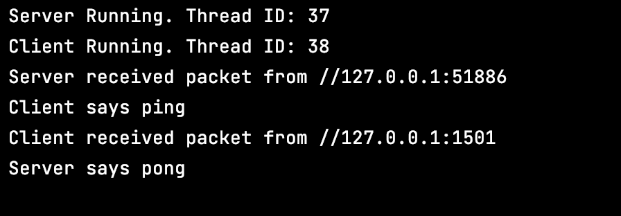

<h4>This repo is to preserve a very simple demo of a UDP exchange.</h4>
 

Doesn't need setup, just run the main method in Game.java in your IDE.

<h4>Running Game.main() generates a dialogue box. </h4>

Clicking Yes creates 2 sockets on localhost, a server on port 1501 and a client dynamically assigned a port.

The client sends a packet with the message 'ping' to the server.  
The server, if it receives the message, replies to the client 'pong'.
  

